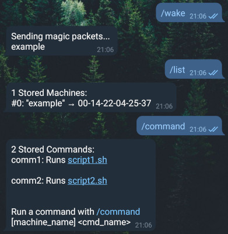

# Shepherd

Wake-on-Lan and SSH Telegram bot



## Commands

> See `/help` for a list of available commands

## Requirements

### Bot host
- python 3.5 or higher
- python venv extension (package name `python3-venv` on Raspberry Pi OS)

### Target machines
- SSH server (only for SSH commands like `/shutdown` and `/command`)
- WOL support (for `/start` command)

## Installation

Clone the repository
```
# mkdir -p /opt/shepherd-bot
# chown -R user:group /opt/shepherd-bot
$ git clone url /opt/shepherd-bot
$ cd /opt/shepherd-bot
```

All config files are in the subfolder `config`.
```
$ cd config
```

For all config files (`config.py`,`users.csv`,`machines.csv`,`commands.csv`) there is an example file. Copy or rename them to omit the `example` from their name and edit the config with your favorite editor (aka `nano`) like this:
```
$ cp config.example.py config.py
$ nano config.py
```
`users.csv`: Set up users that are allowed to use the bot and give them permissions. If you want to give several permissions to one user separate them with a comma, giving the permission "\*" will give this user all available permissions:
```
id;name;chatid;permissions
```

`commands.csv`: Set up commands for the `/command` keyword. The colums in the CSV are the following (also see commands.example.csv for example lines):
```
id;name;type;command;description;permission
```

`machines.csv`: Add servers here, with their MAC address, IP or hostname and other details. Schema is as follows:
```
id;machineName;mac-address;ip-address;ssh-port;username
```
`config.py`: There are several settings in here, like the Telegram API Key that should be used and also settings for permissions and how they are called. Permission management is granular to each command, but by default most of the commands react to the "wake"-permission. This can be changed as needed.

Set up the Python environment
```
$ python -m venv ./shepherd_venv
$ source ./shepherd_venv/bin/activate
(venv)$ pip install -r requirements.txt
```
If any errors occur during the installation of requirements, you are possibly missing some build dependencies. Check from the errors what could be missing and install that with `apt`.

Known required packages that might need to be installed separately:
- Raspberry Pi OS Lite 10 (Buster):
    - libffi-dev: dependency for cffi/Paramiko (Paramiko is used for SSH connections)
- Raspberry Pi OS Lite 11 (Bullseye):
    - none

## Starting the bot
```
$ source ./shepherd_venv/bin/activate
(venv)$ python3 shepherd-bot.py
```

### Autostart on Raspberry Pi

One way to do it is to create a systemd-service that starts the bot launcher script.
First, make sure you have set up the virtualenv already as described in the last section, the launcher script relies on it. Then make the launcher executable.
```
$ chmod +x /opt/shepherd-bot/shepherd-launcher.sh
```

Create a service file in `/etc/systemd/system` and name it accordingly (in this example it will be called `shepherd-bot.service`). You will need SU-rights to create and edit files in this directory.
After creating the file open it and add the necessary config.

```
$ sudo touch /etc/systemd/system/shepherd-bot.service
$ sudo nano /etc/systemd/system/shepherd-bot.service
```

Here is an example configuration for the service-file for Raspberry Pi OS 11

```ini
[Unit]
Description=Shepherd Telegram Bot Service
Requires=network-online.target
After=rc-local.service

[Service]
Type=simple
User=pi
ExecStart=/opt/shepherd-bot/shepherd-launcher.sh

[Install]
WantedBy=default.target

```

After the service file is created, enable and start the service with `systemctl`. Then you can check the logs with `journalctl` once the service is started.

```
$ sudo systemctl enable shepherd-bot.service
$ sudo systemctl start shepherd-bot.service
$ journalctl -u shepherd-bot.service
```

### SSH setup
All commands that are run over SSH require that you have an SSH key on your bot host that is an authorized key on the target machine.
In the example service config above the user is specified as the Raspberry Pi's default user `pi`. This allows us to use this users SSH keys. The user can of course be changed to any other username that your bot host has to offer. The default folder for a users SSH keys is in `$HOME/.ssh`. Make sure one of the public keys from there is added in the authorized keys of your target machine.

### Shutdown command

Besides the setup for an SSH connection over Python, the machine that should be shut down also needs to be prepared.
When running the command `sudo shutdown`, sudo should be configured to not ask for a password with the executing user.
This can be done by running `sudo visudo`. This will open a file, add the following into a new line: `<your_username> ALL=(ALL) NOPASSWD: /sbin/shutdown`, where <your_username> is the username you use as SSH login-detail stored for the Telegram bot.

## Acknowledgements

The base for this repository was [wolbot by Osir](https://github.com/osir/wolbot). Backwards compatibility is not kept, but the version numbering is, so the first official version of Shepherd is 3.0
